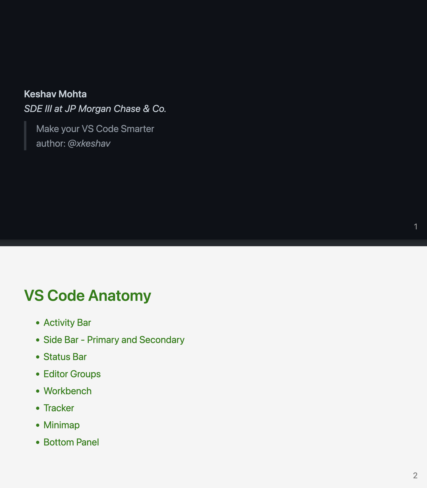

# DOTFILES

This repo contains collection of my own settings, tips and tricks in following categories

## IDE Settings

- VS Code Workspace Settings
- VS Code User Settings
- Sublime Text Settings

## Formatting and linting settings and `.rc` files

- eslintrc file
- editorconfig
- css lint file
- markdown lint file

## OS specific Settings

- Alias in Windows
- Alias in Mac
- Powershell / Shell Script
- github specific tips

## Language specific

- Angular JS Best Practices ( although it has been deprecated )
- React JS Best Practices
- TypeScript tips.

Note: Check other branch for related stuff

---

## React meet up talk slides

- Date: 01 July, 2023
- Venue: Atlassian Office, Bengaluru.
- React Meetup #68 by React Bengaluru group
- Youtube link: [Make your VS Code Smarter](https://www.youtube.com/watch?v=zAkJqU-fp70&t=2h17m39s)
- Slide Screenshot: 
- [Slide PDF](./vscode-slides.pdf) file

note: install [Marp extension](https://marketplace.visualstudio.com/items?itemName=marp-team.marp-vscode) and open _slides.md_ to see the contents

---

Thanks,

Keshav Mohta. <xkeshav@gmail.com>

